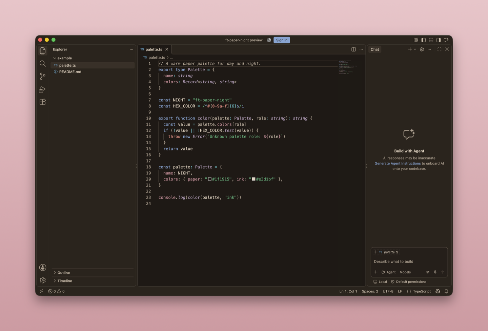

# ft-paper and ft-paper-night for VS Code

One extension with two color themes, generated from the published palettes of
camillehdl.dev:

- `ft-paper`, a light theme from the [day palette](https://camillehdl.dev/palette/).
- `ft-paper-night`, a dark theme from the [night palette](https://camillehdl.dev/palette-night/).

Existing installations receive both themes through the same extension update.




The night screenshot shows VS Code with an isolated profile and the packaged theme.

## Install

- Marketplace: search for `ft-paper` in the Extensions view, or
  `code --install-extension CamilleHodoul.ft-paper`.
- From a local package: `code --install-extension ft-paper-0.3.0.vsix`.

Run **Preferences: Color Theme**, then select `ft-paper` or `ft-paper-night`.

## Colors

Both palette pages list hex values, terminal ANSI slots, and contrast ratios.
The themes use the same syntax roles with each palette's colors.

### Syntax

| Token | Role |
| --- | --- |
| Comment | `ink-muted`, italic |
| String, tag attribute | `jade` |
| Number, boolean | `mandarin` |
| Keyword, control flow, import | `oxford` |
| Function, method, type, class, module | `velvet` (built-in: italic) |
| Operator | `teal` |
| Property, named constant, enum member, HTML tag, macro, escape, decorator, `this`/`self` | `claret` |
| Regular expression, exception | `crimson` |
| Parameter, punctuation | `ink-2` |
| Variable | `ink` |
| Markdown headings 1–2 / 3 / 4 / 5–6 | `claret` bold / `oxford` bold / `oxford` / `teal` |
| Markdown link | `oxford` |

The syntax roles follow the code colors of camillehdl.dev (see the Code roles on the
palette page).

Semantic highlighting is enabled with the same roles.

### Interface

| Area | Role |
| --- | --- |
| Editor, active tab, panel, terminal | background `paper`, text `ink` |
| Side bar, activity bar, title bar, status bar, inactive tabs | background `surface-1` |
| Widgets (hover, suggestions, command palette, menus, inputs) | background `paper-raised`, border `rule` |
| Selection | `surface-2`, with `ink` text in the night theme |
| Cursor | editor (thin bar): `ink`; terminal (block): `claret` over `paper` |
| Current line | border `surface-3` |
| Focus, buttons, badges, links | `oxford` |
| Active tab top border | `claret` |
| Matched characters in lists | `claret` by day, `ink-2` at night |
| Error / warning / info / hint | `crimson` / `mandarin` / `oxford` / `teal` |
| Git added, untracked / modified, renamed / deleted / conflict / ignored | `jade` / `oxford` / `crimson` / `mandarin` / `ink-muted` |
| Diff inserted / removed line | `fill-add` / `fill-remove` |
| Search match / current match | `fill-match` / `fill-target` |
| Terminal ANSI 0–15 | the palette's `terminal.ansi` fields |

VS Code requires translucent colors for diff, search, and merge backgrounds.
Both themes use the published fill recipes. Night recipes mix day accents over
night paper, so a single diff line or editor search wash reproduces its published
`fill-*` color within one RGB step.

Night selection and editor search matches use `ink` text. This keeps the text
readable without hiding selections underneath the fills. Added words and current
conflict headers use an 8% overlay over their added content. Incoming headers and
changed words use 20% over the existing 20%, reproducing `fill-change-focus` at
36% overall. Colored borders also distinguish changed words.

Search editors, peek code, and stopped debugger lines have no match-text color
key. Their night search wash uses the published hue at 17% instead of 34% to keep
the syntax colors readable. Other editor and terminal search washes keep the
published recipe.

## Build

Requires Node.js 18 or later. The generator has no npm dependencies.
Package verification also requires `unzip`.

```sh
npm run palette   # refresh both palettes from their published pages
npm run build     # generate both themes from scripts/theme.mjs
npm run check     # off-palette colors, contrast, unknown keys
npm run package   # package without dependency detection, then verify the VSIX
```

- `palette/ft-paper.json`: the structured data published on the palette page
  (`<script id="ft-paper-palette">`), committed as published.
- `palette/ft-paper-night.json`: the night page's JSON (`#ft-paper-night-palette`).
  The build reads both committed palettes without fetching them.
- `scripts/theme.mjs`: the theme specification, written in palette roles, never in hex.
- `themes/*-color-theme.json`: generated; do not edit by hand.
- `npm run check` exits with code 1 if:
  - a theme contribution has the wrong name, path, or light/dark type;
  - either theme JSON differs from a fresh build;
  - an opaque color is not a palette color or a derived fill;
  - a translucent color has no palette or published recipe base, or no written reason;
  - a required translucent background is opaque, or a night overlay exceeds 60% opacity;
  - night selection visibility under a checked overlay is below a 1.10 contrast ratio;
  - selected night text is below 4.5:1 under the checked overlays;
  - a night diff word or conflict header has less than 1.05 contrast with its content;
  - body text, comments, line numbers or any syntax color is below 4.5:1 on the editor,
    hover or peek background;
  - interface content text, including ghost text and ignored files, is below 4.5:1;
  - night syntax is below 4.5:1 on the checked selection, suggestion, diff, search,
    peek match, list filter, or merge backgrounds;
  - syntax roles, cursor colors, or ANSI slots differ from their palette roles;
  - any night ANSI color is below 4.5:1 on the terminal background;
  - a key is missing from the [theme color reference](https://code.visualstudio.com/api/references/theme-color)
    (skipped when offline).

Packaging runs the build and checks through `vscode:prepublish`.
`npm run package` uses `--no-dependencies` for this extension without dependencies,
then checks the actual archive. The packaged version and contributions must match
`package.json`, both theme files must match the generated files, and the README
and license must be present. You can repeat that check with
`node scripts/check-package.mjs ft-paper-0.3.0.vsix`.

## Known limits

- The day theme is unchanged from 0.2.0. Some syntax colors on selection, diff,
  search, and merge backgrounds remain below 4.5:1. Body text stays above 6:1.
  The check reports these exceptions. The published day ANSI colors also include
  contrasts below 4.5:1 and remain unchanged.
- Disabled text uses `ink-disabled` and is exempt from the content text checks.
  Ignored files and ghost text use `ink-muted` and pass.
- ANSI contrast is checked on the terminal background. ANSI text on colored
  application backgrounds or terminal selections can have lower contrast.
- Keys not set by a theme fall back to VS Code's corresponding light or dark defaults.
  The check covers explicit text/background pairs, not every extension or combination
  of overlapping decorations.

## License

[0BSD](LICENSE).
