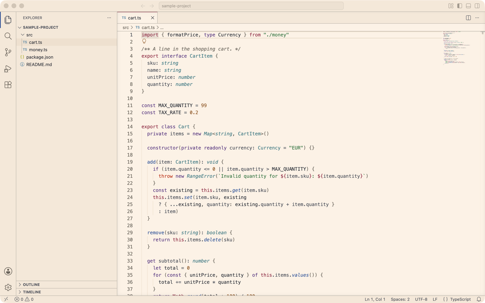

# ft-paper for VS Code

Light color theme for Visual Studio Code, generated from the
[ft-paper palette](https://camillehdl.dev/palette).



## Install

- Marketplace: search for `ft-paper` in the Extensions view, or
  `code --install-extension CamilleHodoul.ft-paper`.
- From a local package: `code --install-extension ft-paper-0.2.0.vsix`.

Then **Preferences: Color Theme** → `ft-paper`.

## Colors

Hex values, ANSI slots and contrast ratios: <https://camillehdl.dev/palette>.
The theme uses palette colors only, referenced by role.

### Syntax

| Token | Role |
| --- | --- |
| Comment | `ink-muted`, italic |
| String, tag attribute | `jade` |
| Number, boolean | `mandarin` |
| Keyword, control flow, import | `oxford` |
| Function, method, type, class, module | `velvet` (built-in: italic) |
| Operator | `teal` |
| Property, named constant, enum member, HTML tag, macro, escape, decorator, `this`/`self` | `claret` |
| Regular expression, exception | `crimson` |
| Parameter, punctuation | `ink-2` |
| Variable | `ink` |
| Markdown headings 1–2 / 3 / 4 / 5–6 | `claret` bold / `oxford` bold / `oxford` / `teal` |
| Markdown link | `oxford` |

The syntax roles follow the code colors of camillehdl.dev (see the Code roles on the
palette page).

Semantic highlighting is enabled with the same roles.

### Interface

| Area | Role |
| --- | --- |
| Editor, active tab, panel, terminal | background `paper`, text `ink` |
| Side bar, activity bar, title bar, status bar, inactive tabs | background `surface-1` |
| Widgets (hover, suggestions, command palette, menus, inputs) | background `paper-raised`, border `rule` |
| Selection | `surface-2` |
| Cursor | editor (thin bar): `ink`; terminal (block): `claret` over `paper` |
| Current line | border `surface-3` |
| Focus, buttons, badges, links | `oxford` |
| Active tab top border, matched characters | `claret` |
| Error / warning / info / hint | `crimson` / `mandarin` / `oxford` / `teal` |
| Git added, untracked / modified, renamed / deleted / conflict / ignored | `jade` / `oxford` / `crimson` / `mandarin` / `ink-muted` |
| Diff inserted / removed line | `fill-add` / `fill-remove` |
| Search match / current match | `fill-match` / `fill-target` |
| Terminal ANSI 0–15 | the palette's `ansi` slots |

Derived fills (`fill-*`) are written as their palette recipe (hue + alpha), because
VS Code requires translucent colors for highlight, diff and merge keys.

## Build

Requires Node.js 18 or later. No dependencies.

```sh
npm run palette   # refresh palette/ft-paper.json from https://camillehdl.dev/palette
npm run build     # scripts/theme.mjs → themes/ft-paper-color-theme.json
npm run check     # off-palette colors, contrast, unknown keys
npx @vscode/vsce package
```

- `palette/ft-paper.json`: the structured data published on the palette page
  (`<script id="ft-paper-palette">`), committed as is. The build reads only this file.
- `scripts/theme.mjs`: the theme specification, written in palette roles, never in hex.
- `themes/ft-paper-color-theme.json`: generated; do not edit by hand.
- `npm run check` exits with code 1 if:
  - the theme JSON differs from a fresh build;
  - an opaque color is not a palette color or a derived fill;
  - a translucent color has no palette base or no written reason;
  - a key VS Code requires to be translucent is opaque;
  - body text, comments, line numbers or any syntax color is below 4.5:1 on the editor,
    hover or peek background;
  - interface text is below 4.5:1 (disabled and ghost text are reported, not failed);
  - a key is missing from the [theme color reference](https://code.visualstudio.com/api/references/theme-color)
    (skipped when offline).

## Known limits

- On transient backgrounds (selection, diff, search matches), some syntax colors fall
  below 4.5:1; body text stays above 6:1. `npm run check` lists the figures.
- Ignored files in the Git decorations (`ink-faint`, 3.79:1) and ghost text
  (`ink-faint`, 4.14:1) are below 4.5:1 by design.
- Keys not set by the theme fall back to VS Code's default light theme.

## License

[0BSD](LICENSE).
